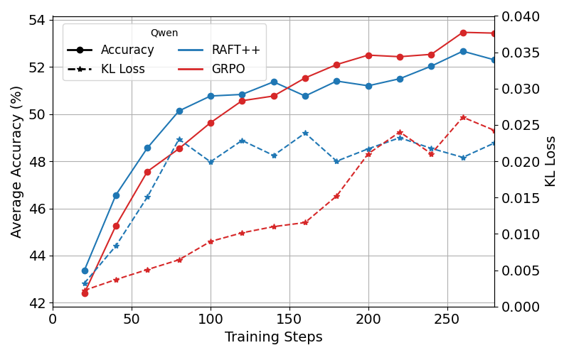
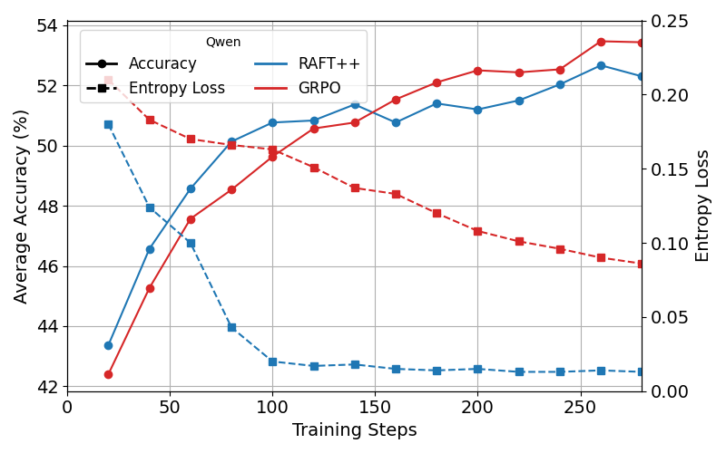
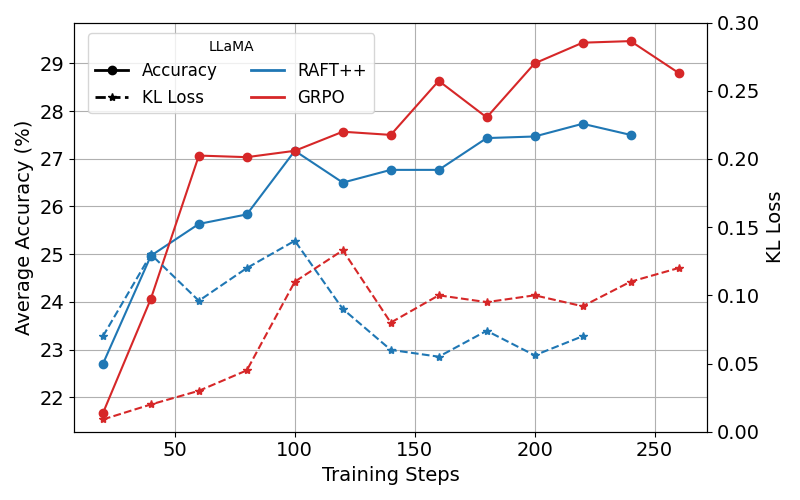
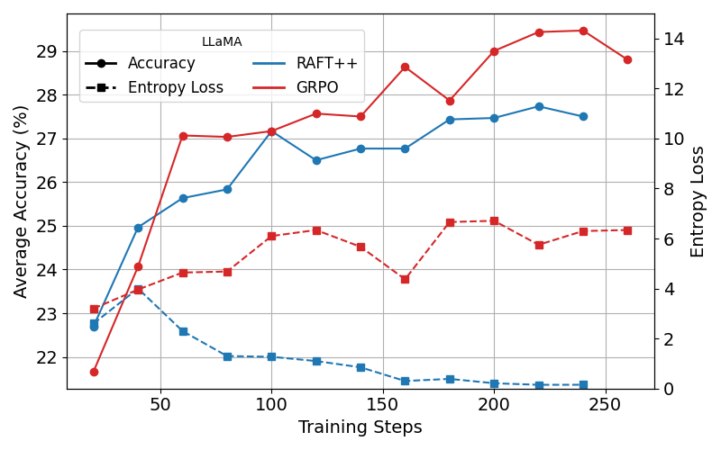
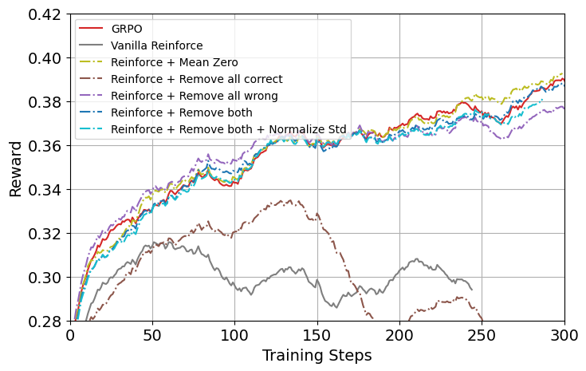
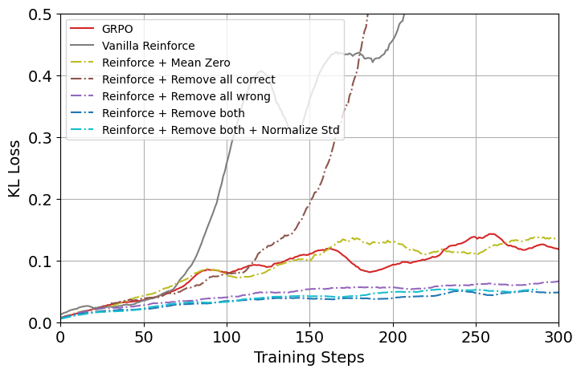
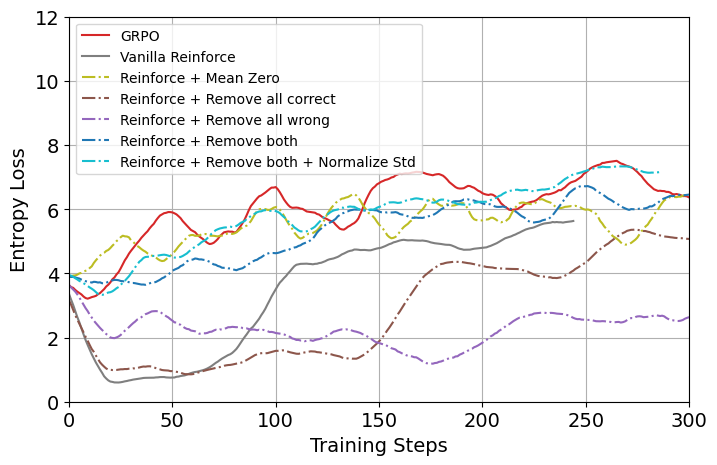

<div align="center">

# A Minimalist Approach to LLM Reasoning: from Rejection Sampling to Reinforce
[](https://arxiv.org/pdf/2504.11343) [](https://github.com/RLHFlow/Minimal-RL)
</div>

## Table of Contents
- [Introduction](#introduction)
- [Environment Setup](#environment-setup)
- [Experiments Running](#experiments-running)

## Introduction
We investigate reinforcement learning (RL) algorithms in the context of fine-tuning large language models (LLMs) with verifiable rewards and mathematical reasoning tasks. While GRPO stands out as one of the most widely used algorithms for enhancing LLMs on math reasoning tasks due to its success in training DeepSeek-R1, its algorithmic details remain largely undocumented. and it is unclear whether its adoption stems from inherent advantages or, rather, from continuity with methods used in their previous studies. In this project, we revisit the following algorithms, with the goal of understanding the key factor behind the success of current RL practice:
1. RAFT(++), also know as rejection sampling in LLM literature, which is arguably the most basic RL algorithm for LLM post-training. We enhance the vainilla RAFT with additional importance sampling and clipping to obtain its variant RAFT++;
2. Vanilla Reinforce, a classical policy gradient algorithm, serves as a simplified version of PPO by eliminating the critic model, and 
3. GRPO, a Reinforce algorithm variant, samples $n$ responses per prompt and computes relative advantages by normalizing the sample reward using mean and standard deviation within each prompt.

<p align="center">
  
  
</p>
<p align="center">
  
  
</p>

**Main Takeaways**
1. **RAFT++ vs. Reinforce/GRPO:** From RAFT++ to Reinforce (including GRPO): RAFT++ performs surprisingly well, approaching competitive final performance with small gap compared to GRPO and achieving faster early-stage convergence, despite its simplicity.
2. **Positive-Only Training & Entropy Collapse:** Training solely on positive samples (as in RAFT++) accelerates convergence but leads to early entropy collapse. Once entropy stabilizes, performance plateaus. The negative samples play a crucial role in maintaining exploration and preventing distributional collapse. This exploration benefit is likely a contributing factor to the performance gap between RAFT++ and RL-based methods such as Reinforce and GRPO.
3. **From Vanilla Reinforce to GRPO**: we find that for on-policy methods, training on prompts where all sampled responses are incorrect can significantly harm performance. We further identify that the performance gain of GRPO over standard Reinforce largely stems from its implicit filtering of these harmful prompts. In contrast, reward normalization techniques by mean and standard deviation within a prompt have minimal impact.
4. **A New Variant – Reinforce-rej**: Motivated by our studies with both RAFT and Reinforce, we study a new Reinforce variant, *Reinforce-rej*, which selectively filters out prompts with either all correct or all incorrect responses. This method enjoys comparable final performance to GRPO, and demonstrates superior KL efficiency.


<p align="center">
  
</p>


<p align="center">
  
    
</p>

## Environment Setup
1. Create a new environment.
   ```bash
   python -m venv ~/.python/raftpp
   source ~/.python/raftpp/bin/activate
   # You can also use conda 
   #conda create -n raftpp python==3.10
   #conda activate raftpp
   ```
2. Install dependencies
   ```bash
   pip install pip --upgrade
   pip install uv
   python -m uv pip install torch==2.4.0 --index-url https://download.pytorch.org/whl/cu124
   python -m uv pip install flash-attn --no-build-isolation
   git clone https://github.com/RAFT-PlusPlus/RAFT-PlusPlus.git
   cd RAFT-PlusPlus/
   python -m uv pip install -e .
   python -m uv pip install vllm==0.6.3
   ```

## Experiments Running
1. Prepare the training and test datasets.
    ```bash
    python scripts/data_preprocess/math_dataset.py
    python scripts/data_preprocess/numina_math.py
    ```
2. Start the training loop.
   ```bash
   bash scripts/run_raftpp.sh
   bash scripts/run_reinforce_rej.sh
   ```

## Acknowledgement
We greatly thanks [verl](https://github.com/volcengine/verl) for providing the awesome codebase!
